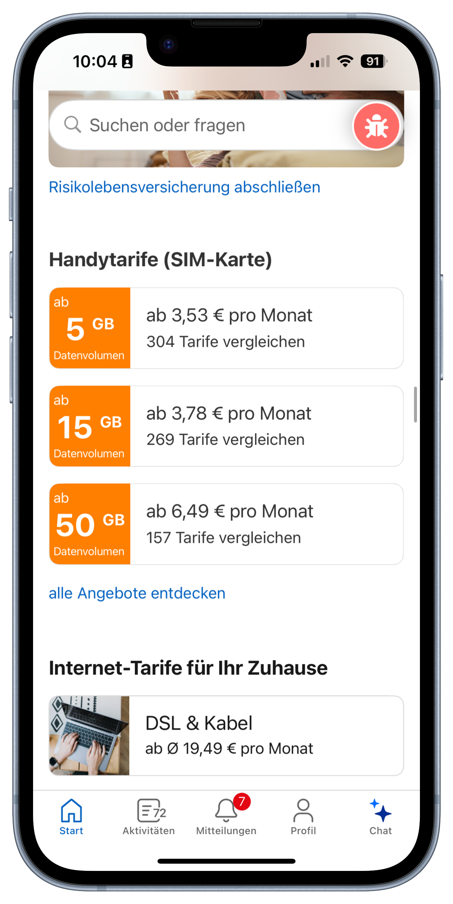

# CHECK24 GenDev Technical Concept Challenge

**Note:** This is the challenge for the GenDev IT Scholarship. Applications are open until December 28th 2025 — the program kicks off in February! We're looking forward to your application. 🤓

Showcase your architectural expertise by designing a technical concept and implement a proof of concept - as even in the era of Cursor, a solid grasp of the underlying technologies is key.

# Table of Contents

<!-- TOC -->
* [The Challenge 🤔](#the-challenge-)
  * [The Catch](#the-catch)
  * [Minimum Requirements](#minimum-requirements)
* [The Feature ✨](#the-feature-)
  * [What Is A "Home Widget"?](#what-is-a-home-widget)
  * [Major Guiding Principles for Home Widgets 💅](#major-guiding-principles-for-home-widgets-)
    * [Handle High Traffic While Serving Fresh Data](#handle-high-traffic-while-serving-fresh-data)
    * [Flexibility In Mind](#flexibility-in-mind)
    * [Personalization](#personalization)
    * [Cross-Device Consistency](#cross-device-consistency)
    * [Every Millisecond Counts - But Conversion Takes More Than Speed](#every-millisecond-counts---but-conversion-takes-more-than-speed)
    * [High Availability by Design](#high-availability-by-design)
* [The Concept 🧠](#the-concept-)
  * [Clarity Turns Concepts Into Reality](#clarity-turns-concepts-into-reality)
  * [Deployment](#deployment)
  * [Performance and High Availability in Mind](#performance-and-high-availability-in-mind)
  * [Developer Experience](#developer-experience)
  * [Scalability & Long-Term Perspective](#scalability--long-term-perspective)
  * [Decision Rationale & Trade-offs](#decision-rationale--trade-offs)
  * [Creativity](#creativity)
* [How To Hand In Your Application 🚀](#how-to-hand-in-your-application-)
* [Questions?](#questions)
<!-- TOC -->

# The Challenge 🤔

You'll design and implement the **next generation of Home Widgets** - flexible, product-driven sections that bring personalized content to the CHECK24 Home across Web and App.

Create a **technical concept** and a **working Proof of Concept (PoC)** that shows how decentralized CHECK24 products (e.g. our flight comparison, internet comparison, ...) can contribute dynamic, performant, and personalized content to a central Home experience.

You decide the architecture, technologies, and infrastructure - but you must justify every choice.
While reasoning about your decisions, focus on the sustainability (as in "future maintainability") of your system.
Quantify your choices wherever it makes sense.

## The Catch

CHECK24 was built with decentralization in mind. All our comparison products are individual legal entities (so-called "speedboats") with their own teams consisting of IT, Product Management and Customer Service. There is barely any technical coupling between the central "Core" systems and the product systems.

This means that every product is responsible for its own, independent system architecture and infrastructure. They have full ownership and flexibility over their systems and their data.
There is no shared data persistence layer across products.

Now, there's one thing that the products have in common: the platform they're all integrated into: CHECK24. We want to offer our customers a personalized experience, despite the decentralized nature of our customer data.
For example, we display relevant widgets to the customer on the Home page. Another example is our "Insurance Center", where we display an aggregated view of all insurances that the customer has booked via different CHECK24 insurance products (e.g. personal liability insurance, pet insurance, ...), and offer a smart saving potential analysis.

To achieve this degree of personalization, the data have to come together in a way that satisfies different perspectives: performance, user experience, what the individual product systems are technically capable of - and, even more important: what they are **not** capable of.

## Minimum Requirements

This challenge is all about **concept** work.
To successfully apply for GenDev 8, you need to provide to us the following deliverables:

- **GitHub Repository** including all the below deliverables and your proof-of-concept code. Make the repository **private**, and give read access to `gendev@check24.de`.
- `CONCEPT.md`: a detailed technical concept document, addressing Core engineering teams (who should implement the central part of the system)
- `DEVELOPER_GUIDELINE.md`: dedicated instructions for the decentralized product teams to integrate or build their own Home Widgets.
- **Proof of Concept (PoC)**: live, working deployment, demonstrating the feasibility of your concept by providing at least one Home Widget per platform.
- **Application Video**: explain your concept, your decisions, and how your solution meets the guiding principles by recording a video. Do **not** simply submit a demo video of your PoC. The video can be up to 5 minutes long (hard limit). This video can be hosted outside of your GitHub repository.
- `README.md`: one document that ties all deliverables together, at the root level of your repository. Include links to **all** the other deliverables (including a link to your application video and a link to your live deployment).

There is one more hard requirement: **Multi-Platform Support**. Your **concept** should address at least one Native App platform (iOS/Swift **or** Android/Kotlin) **and** a Web version.

# The Feature ✨

Every user who visits check24.de or uses the smartphone app will first see our "Home" page.
For check24.de (in the browser) this is web technology.
For the smartphone users, this part is implemented in Swift (iOS) or Kotlin (Android).

Since every user sees this view in the beginning, **it is our most frequently visited page.**
We have multiple components that enable further personalization - all developed with high availability, performance, efficiency and scalability in mind.

Within this challenge, the "Home Widgets" have to be re-thought thoroughly and re-built in a green field environment.
During this rebuild, we want to give the decentralized products more flexibility.
They can autonomously decide in which way they want to address the user on the centralized Home page: personalized content, a personalized layout, personalized everything - all based on factors only products can provide.

## What Is A "Home Widget"?

Home Widgets introduce a cross-device (Mobile, Desktop, Native App) approach for product-driven sections appearing on the Home page, based on user interactions throughout all 60+ CHECK24 comparison products.

Some visual examples on how it might look like (check out [check24.de](https://check24.de) or the CHECK24 iOS/Android App for more):

**Example 1**

This screenshot shows two Home Widgets within the Native App (iOS in this case):

- "Ihre gesicherten Top Deals" - personalized top deals saved by the user across various CHECK24 comparison products (decentral wishlist functionality aggregated by the centralized CHECK24 Core Unit)
- "Möbel für Ihr Zuhause" - furniture recommendations based on the user’s browsing behavior in the CHECK24 furniture comparison product

**Example 2**

This screenshot shows three Home Widgets within the Native App:

- "Risikolebensversicherung abschließen" - encourages the user to compare risk life insurance offers tailored to them
- "Handytarife (SIM-Karte)" - personalized mobile plan recommendations
- "Internet-Tarife für Ihr Zuhause" - personalized internet plan offers

**Example 3**

The web version works the same way. In this example, you can see three Home Widgets:

- "Unsere besten Urlaubsreisen – Side & Alanya" - personalized vacation package recommendations
- "Handytarife (nur SIM-Karte) vergleichen" - tailored mobile plan recommendations
- "Kredite von über 300 Banken vergleichen" - custom loan offers personalized to the user

_These are just some examples - the actual content, layout, and personalization logic will be defined by the individual products. Make sure you're thinking of a flexible architecture that empowers products to create their own unique Home Widgets, while adhering to the major guiding principles outlined below._

## Major Guiding Principles for Home Widgets 💅

### Handle High Traffic While Serving Fresh Data

The Home experiences vastly higher and more volatile traffic than any individual product system. Especially during marketing campaigns, seasonal events, or prime-time spikes, direct calls to product systems could easily exceed their capacity and harm critical revenue flows in decentralized product journeys. Each product operates its own infrastructure with unknown performance limits - therefore, the Home must never amplify its load.

At the same time, the Home should present data that is as fresh and relevant as possible. Outdated information reduces user trust and may lead to poor conversion or cross-sell potential. Balancing *data freshness* with *system protection* is therefore essential.

Example: when a user converts a car-insurance quote into an active contract, the Home should no longer show a "Car Insurance Comparison" widget, but may display recommendations based on the user's existing insurance data. This state change must not be handled through centralized logic within the Home, as that would quickly turn it into a performance and ownership bottleneck.

### Flexibility In Mind

With this decentralized architecture, products should never be blocked by the central "Core" units.

Each product must be able to evolve its Home Widgets - both in content and layout - independently and without depending on Core release cycles.

When designing your solution, prioritize **autonomy and adaptability**: products should have the freedom to experiment, iterate, and personalize their Widgets while the Core provides only the minimal necessary boundaries for stability, performance, and security.

**Keep limitations to what is essential.**

A product may want to support multiple use cases or layout variations within one or several Widgets - your architecture should make this possible **without introducing unnecessary coupling** to the products.

Due to App Store and Play Store release restrictions, layout changes in native apps typically require a new release. However, content updates can and should remain dynamic and independent of the app release cycle.

### Personalization

Personalization is a key aspect of the Home experience - it should feel relevant to each user while respecting the decentralized nature of CHECK24's product landscape.

Each product owns the knowledge about its customers and is therefore best suited to decide *what* to show and *when*. Your concept should empower products to provide personalized widget content or layout variants based on their own signals, while you might think of the Home more as an orchestrator.

### Cross-Device Consistency

Users interact with CHECK24 across multiple devices - often seamlessly switching between mobile, desktop, and native app. Your concept must ensure that the Home feels consistent and personalized across all devices while respecting each platform's unique design and technical characteristics.

That said, when a user is logged in, the Home should reflect a consistent state across devices. Widget content and personalization decisions should be based on the same underlying user context - meaning that actions or events on one device (e.g., completing a car insurance quote) are reflected on another.

A user shouldn't see conflicting or outdated information just because they switched devices.

### Every Millisecond Counts - But Conversion Takes More Than Speed

The Home is the first touchpoint for millions of users - every millisecond counts.

A great user experience on the Home must feel **instant, responsive, and visually stable**, regardless of whether content comes from one central source or dozens of product systems. It's crucial to understand **which UX trade-offs are acceptable** to protect or even improve conversion. Fast, clean, and intuitive interfaces usually lead to better engagement - but not every optimization purely for aesthetics pays off in measurable value. Think about that, and maybe do some research about key indicators for conversion loss, since your concept should consciously balance *perceived quality* and *conversion effectiveness*.

### High Availability by Design

The Home must always be available - no matter the traffic, load, or product system state.

It is the entry point for millions of daily sessions, and downtime directly affects user trust and revenue. Your concept should treat **availability not as an afterthought**, but as a **core design goal**.

Assume that dependencies will fail - because they will. The Home should never be down just because a single product system, API, or service is temporarily unreachable.

# The Concept 🧠

Your task is to design a **technical concept** for the new Home Widgets - and to implement a **Proof of Concept (PoC)** that demonstrates the feasibility of your ideas.

The goal is not only to describe *what* the system does, but to show *how* it can be built, scaled, and operated sustainably within the CHECK24 ecosystem.

**TL;DR: What We're Looking For In Your Concept:**

- **Performance & Scalability** – handles high traffic and large user volumes
- **High Availability** – always accessible, fails gracefully
- **Personalization** – relevant content per user without central coupling
- **Multi-Platform Consistency** – coherent user experience across Web, Web View, and App
- **Cross-Device Consistency** – synchronized state across devices for logged-in users
- **Developer Experience** – long-lasting, easy-to-adopt solution for decentralized teams
- **Deployment Concept** – automated, zero-downtime, and reproducible
- **Decision Transparency** – clear rationale and justified trade-offs
- **Creativity** – thoughtful extensions, improvements, or smart shortcuts

## Clarity Turns Concepts Into Reality

Your audience for the `CONCEPT.md` deliverable are **Core unit engineers** who will implement your concept and build the platform-side infrastructure for Home Widgets.

Do not leave out any critical specification - missing details will stall development, and your Home Widgets will never make it to production on time. Document every essential aspect clearly: architecture decisions, APIs, data flows, dependencies, and operational assumptions.

In addition, provide a **separate developer guideline** (`DEVELOPER_GUIDELINE.md`) for decentralized product teams.
This document should explain how products can **integrate or build their own Home Widgets**, including required interfaces, data formats, and best practices for testing and deployment.

## Deployment

Include a well-thought-out deployment concept - covering parts you think are necessary for fulfilling the requirements of the Home. Justify your technology choices, address potential vendor lock-in, and explain cost or operational considerations (e.g., cloud vs. on-premise).

The deployment must be part of your PoC and **run live** as an MVP (minimal valuable product, the smallest possible instance configuration, to demonstrate feasibility).
**The deployed system must match your deployment specification** - this means that you cannot deploy on e.g. Vercel if you did not include Vercel in your concept.

Do **not** focus on the deployment process itself (pushing images to a registry, running pipelines), but on the target architecture: what are your system components, and how do they talk to each other?

## Performance and High Availability in Mind

Show how your concept handles high traffic and ensures efficient resource use. Think about caching, async patterns, and how personalization can scale without latency spikes.

Your design should tolerate failures and remain accessible at all times. Show how you achieve redundancy, fault isolation, and graceful degradation.

## Developer Experience

Find the balance between simplicity and necessary complexity. Products should be able to integrate Widgets easily.

Remember, CHECK24 products use different tech stacks and infrastructures. Your concept must work across this diversity - loosely coupled, tech-agnostic, and easy to adopt.

## Scalability & Long-Term Perspective

Think beyond the PoC. Show how your concept can evolve as products, traffic, and personalization grow. Identify technical bottlenecks and propose future improvements.

Anticipate needs such as data storage, caching layers, throughput, and compute capacity.

Rough sizing or estimation is sufficient - we're looking for your reasoning, not exact numbers.

## Decision Rationale & Trade-offs

All key decisions in your concept must be **transparent, fact-based, and justified**.

Explain why you made specific choices - such as selecting a cloud provider vs. on-premise setup, introducing (or avoiding) certain technologies, or taking shortcuts in your PoC.

Clearly state your **assumptions**, their **source or reasoning**, and how they influence your design.

Avoid vague arguments like "it's faster" or "more modern" - back your reasoning with data, constraints, or measurable goals.

No major question should remain unanswered: reviewers with engineering backgrounds (your audience) must be able to understand and reproduce your line of thought without guessing.

**Make sure that your document is concise**: avoid rambling and wordy, ChatGPT-like answers that have a lot of words but little content. We value content over fancy formulations.

## Creativity

Go beyond the basics. Suggest improvements, additional features, or innovative patterns that could make the system more powerful, usable, or efficient.

And there's this thing... AI?! 🙂

# How To Hand In Your Application 🚀

- **Video (max. 5 minutes):**
  - Present your overall **concept**, not just the frontend of your PoC.
  - Explain the reasoning behind your architecture, key decisions, and how the system meets the guiding principles.
  - Link the Video in your GitHub repository README.

- **Live Deployment:**
  - Your Proof of Concept must be **deployed and accessible**, following your own deployment concept.
  - The environment should reflect the principles you described - automated, reproducible, and available for review.

- **Repository & Documentation:**
  - Submit your work in a **private GitHub repository**.
  - Include your **concept and documentation as Markdown files** within the repository (e.g., `/docs/` or root) next to the **implemented PoC**.
  - Invite the GitHub account **gendev@check24.de** for review access.
  - When you hand in your application, include the link to your GitHub repository.

# Questions?
In case of any questions, contact gendev@check24.de
